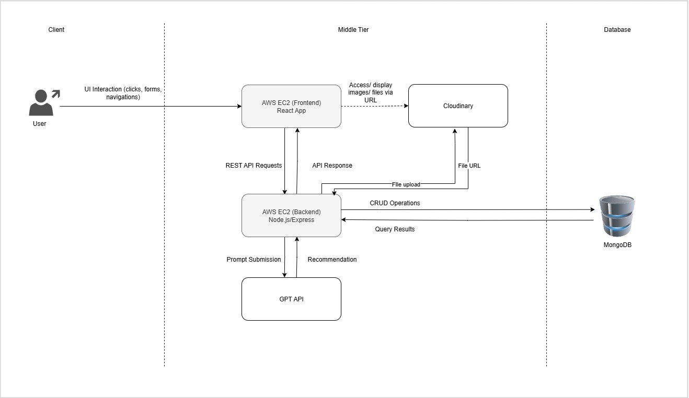
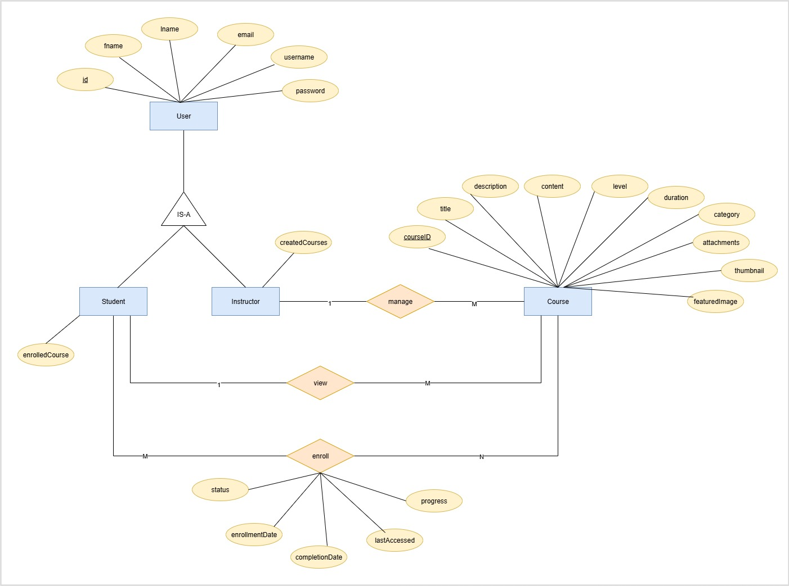

<p align="center">
  
</p>

---

# 📚 CourseHub GPT – Online Learning Platform

A full-stack **MERN application** for online learning with **ChatGPT integration**.
The system allows **students** to enroll in courses and get AI-driven recommendations, while **instructors** can create and manage courses.

🔗 **Live Link:** [http://13.60.241.237:3000](http://13.60.241.237:3000)

---

## 🚀 Features

### 👩‍🎓 Student Features

* Register & login securely (JWT authentication)
* View all available courses
* Enroll in courses and view enrolled courses
* AI-powered course recommendations using GPT

### 👨‍🏫 Instructor Features

* Register & login
* Create, update, and delete courses
* View all created courses
* Manage enrolled students for each course

### 🤖 GPT Integration

* Personalized course suggestions
* Students can enter prompts like:

  > *"I want to be a software engineer, what courses should I follow?"*
* Returns AI-driven course recommendations

---

## 🛠️ Tech Stack

* **Frontend**: React.js
* **Backend**: Node.js, Express.js
* **Database**: MongoDB Atlas
* **File Storage**: Cloudinary
* **AI Integration**: OpenAI GPT API

---

## ⚙️ System Architecture



**Flow:**

```
Frontend (React + AWS EC2)
        |
        v
Backend API (Node + Express + AWS EC2)
        |
        +---> MongoDB Atlas (Database)
        |
        +---> Cloudinary (File Handling)
        |
        +---> OpenAI GPT (Course Recommendations)
```

---

## 🗂️ Database Design

### ER Diagram



### User Schema

```js
{
  _id: ObjectId,
  name: String,
  email: String,
  usernamer: String,
  password: String (hashed),
  role: String ("student" | "instructor"),
  enrolledCourses: [ObjectId] // references Course
  createdCourses: [ObjectId] // references Course
}
```

### Course Schema

```js
{
  _id: ObjectId,
  title: String,
  description: String,
  content: String,
  instructor: ObjectId, // reference User
  students: [ObjectId], // references User### Enrollment Schema
  category: String,
  duration: String,
  level: String ("Beginner" | "Intermediate" | "Advanced"),
  isPublished: Boolean,
  thumbnail: String (Cloudinary URL),
  featuredImmage: String (Cloudinary URL),
  attachments: [{
    filename: String,
    originalName: String,
    url: String,
    fileType: String,
    uploadedAt: {
        type: Date,
        default: Date.now
    }
  }]
}
```
### Enrollment Schema

```js
{
  _id: ObjectId,
  student: ObjectId, // reference User
  course: ObjectId, // reference Course
  status: String ("Enrolled" | "Completed" | "Cancelled" | "in-progress"),
  enrollmentDate: Date,
  completionDate: Date
  progress: Number (0-100),
  lastAccessed: Date
}
```

---

# 🔑 API Documentation

## **Authentication** (`/auth`)

* **POST** `/auth/register` → Register a new user (student or instructor)
* **POST** `/auth/login` → Login, returns JWT

---

## **Users** (`/users`)

* **GET** `/users/all-users` → Get all users (🔒 Protected)
* **GET** `/users/role/:role` → Get all users by role (🔒 Protected)
* **GET** `/users/user/:id` → Get single user by ID (🔒 Protected)
* **PUT** `/users/update-user/:id` → Update user details (🔒 Protected)
* **DELETE** `/users/delete-user/:id` → Delete user by ID (🔒 Protected)

---

## **Courses** (`/courses`)

* **GET** `/courses/all-courses` → Get all courses

* **GET** `/courses/course/:id` → Get course by ID

* **GET** `/courses/course-instructor/:instructorId` → Get all courses by instructor

* **GET** `/courses/course-student/:studentId` → Get all courses enrolled by a student

* **POST** `/courses/create-course` → Create a new course (🔒 Protected, Instructor only, supports file uploads: `thumbnail`, `featuredImage`)

* **PUT** `/courses/update-course/:id` → Update a course (🔒 Protected, Instructor only, supports file uploads)

* **DELETE** `/courses/delete-course/:id` → Delete a course (🔒 Protected, Instructor only)

**Course Attachments**

* **POST** `/courses/:id/attachments` → Upload an attachment to a course (🔒 Protected)
* **DELETE** `/courses/:id/attachments/:attachmentId` → Remove an attachment from a course (🔒 Protected)

---

## **Enrollments** (`/enrollments`)

* **GET** `/enrollments/my-courses` → Get courses enrolled by the authenticated student (🔒 Protected)

* **POST** `/enrollments/enroll-course/:id` → Enroll in a course by ID (🔒 Protected)

* **PUT** `/enrollments/update-enrollment/:id` → Update enrollment details (🔒 Protected)

* **GET** `/enrollments/course/:courseId` → Get all enrollments for a course (🔒 Protected, Instructor/Admin only)

---

## **AI Recommendations** (`/ai-recommendations`)

* **POST** `/ai-recommendations/recommend` → Get general course recommendations (rate-limited, public)
* **POST** `/ai-recommendations/recommend/personalized` → Get personalized recommendations based on user history (🔒 Protected, rate-limited)

**Testing & Monitoring**

* **GET** `/ai-recommendations/ai-status` → Check AI service status
* **POST** `/ai-recommendations/reset-requests` → Reset request count (testing only)
* **POST** `/ai-recommendations/test-gpt` → Test GPT response
* **GET** `/ai-recommendations/test-gpt-connectivity` → Test GPT connectivity

---

## **AI Request Logs** (`/ai-status`)

* **GET** `/ai-status` → Get AI service usage/request log status

---

## ⚡ Setup Instructions

### 1️⃣ Clone the Repository

```bash
git clone https://github.com/nuwani-sithara/coursehub-gpt.git
cd coursehub-gpt
```

---

### 2️⃣ Backend Setup (Separate EC2 Instance or Folder)

```bash
cd backend
npm install
```

Create `.env`:

```env
PORT=5000
MONGO_URI=your_mongodb_atlas_uri
JWT_SECRET=your_jwt_secret
CLOUDINARY_CLOUD_NAME=your_cloudinary_name
CLOUDINARY_API_KEY=your_cloudinary_key
CLOUDINARY_API_SECRET=your_cloudinary_secret
OPENAI_API_KEY=your_openai_key
```

Run backend with **PM2** (recommended):

```bash
pm2 start server.js
```

The backend will now be available at:

```
http://<your-ec2-ip>:5000
```

---

### 3️⃣ Frontend Setup (Separate EC2 Instance or Folder)

```bash
cd frontend
npm install
npm run build
```

Install **serve** globally to serve the React production build:

```bash
npm install -g serve
```

Run the frontend on port `3000`:

```bash
serve -s build -l 3000
```

The frontend will now be available at:

```
http://<your-ec2-ip>:3000
```

---

✅ With this architecture:

* Backend lives on **EC2:5000** [http://13.62.103.64:5000](http://13.62.103.64:5000)
* Frontend lives on **EC2:3000** [http://13.60.241.237:3000](http://13.60.241.237:3000)
* Both can also be hosted on separate EC2 instances if needed (your setup still works fine either way).

---

## 📖 Deliverables

* ✅ GitHub Repository
* ✅ Backend & Frontend deployed on **AWS EC2**
* ✅ System Architecture Diagram
* ✅ ER Diagram
* ✅ Documentation (this README)

---
